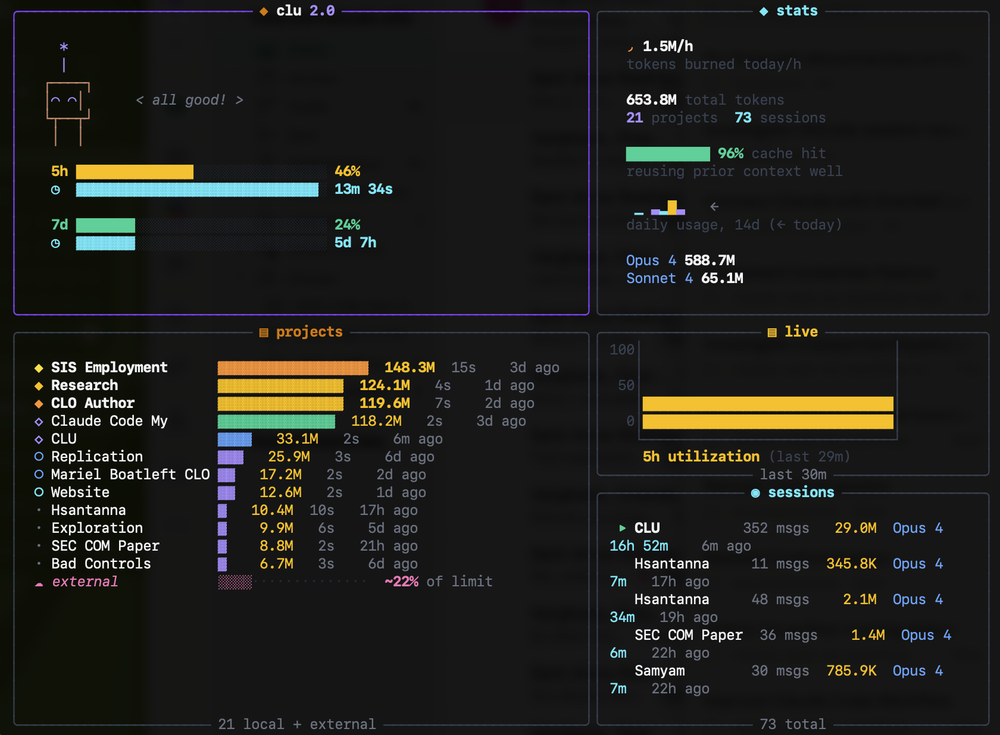

# clu - Claude Usage Monitor

A terminal tool that monitors your Claude Code usage — from a cute animated widget to a full per-project dashboard.

[](https://pypi.org/project/clu-widget/)

[](https://marketplace.visualstudio.com/items?itemName=hsantanna.clu)



## VS Code Extension

Install from the [VS Code Marketplace](https://marketplace.visualstudio.com/items?itemName=hsantanna.clu) — usage in your status bar, click for the full dashboard.


## What it does

**Widget mode** (default) — the original cute clu:
- 5-hour and 7-day sliding window usage with progress bars
- Reset countdowns for each window
- Token counts for the current period
- A little animated creature to keep you company

**Dashboard mode** (`--dash`) — full terminal dashboard:
- Everything from widget mode, plus:
- Per-project token breakdown with smart project names (parsed from local Claude Code data)
- Real-time utilization chart (live 5h usage over time)
- Session history with duration, message count, and model used
- Cache hit rate and efficiency metrics
- Daily token sparkline (14-day trend)
- Model usage breakdown
- External/untracked usage estimation (percentage of rate limit)
- Multi-source support (local + HPC + any synced `.claude` directory)

## Installation

```bash
# Install from PyPI
pip install clu-widget

# Or install from source
git clone https://github.com/hugosantanna/clu-widget.git
cd clu-widget
pip install .
```

## Usage

```bash
# Widget mode — cute animated companion
clu

# Dashboard mode — full terminal dashboard
clu --dash

# Include data from a remote machine (e.g. HPC)
clu --dash --data-dir ~/hpc-sync/.claude

# Multiple remote sources
clu --dash --data-dir ~/hpc-sync/.claude --data-dir ~/server-sync/.claude

# Custom refresh interval
clu --refresh 90

# Don't resize the terminal window
clu --no-resize

# Pass a token directly
clu --token sk-ant-...

# Pass a claude.ai session key (see "Session Key" below)
clu --session-key sk-ant-sid02-...
```

### Options

| Flag | Description |
|------|-------------|
| `--dash` | Full-terminal dashboard with per-project stats |
| `--data-dir PATH` | Additional `.claude` data directory (repeatable) |
| `--refresh N` | API refresh interval in seconds (default: 90) |
| `--window N` | Time window for sessions/projects: 5, 15, or 24 hours (default: 5) |
| `--no-resize` | Don't resize the terminal window |
| `--token TOKEN` | Override OAuth token |
| `--session-key KEY` | claude.ai session cookie (or set `CLU_SESSION_KEY` env var) |

## Using with HPC / Remote Machines

The dashboard reads local Claude Code conversation data from `~/.claude/projects/`. If you run Claude Code on an HPC or remote server, you can sync that data to see it locally:

```bash
# Sync from HPC (run periodically or via cron)
rsync -az hpc:~/.claude/ ~/hpc-sync/.claude/

# Then view everything together
clu --dash --data-dir ~/hpc-sync/.claude
```

The API usage (5h/7d windows) is account-level — it shows all usage regardless of where Claude Code runs. The per-project breakdown comes from local JSONL files, so those need to be synced from remote machines.

## How Usage Data is Fetched

As of v2.3.0, Anthropic blocked the OAuth usage endpoint for consumer plans (Max/Pro). clu now fetches usage data from **claude.ai's web API** using your browser session cookie, with the old OAuth API as a fallback.

**Data flow (in priority order):**

1. **claude.ai web API** — uses your `sessionKey` cookie via cloudscraper to bypass Cloudflare. This is what the claude.ai settings page uses internally.
2. **OAuth API** (legacy fallback) — uses your Claude Code OAuth token. May not work on consumer plans.

### Session Key

clu tries to get the session key automatically from Claude Desktop's cookie store:

- **macOS**: reads from Keychain (one-time approval prompt)
- **Windows**: decrypts via DPAPI from `%APPDATA%/Claude/`
- **Linux**: reads from Secret Service (GNOME Keyring / KDE Wallet) with Chromium fallback

If Claude Desktop is installed and you've logged in, this happens automatically. If auto-discovery doesn't work, clu will prompt you interactively on first run:

```
  ◆ Session key needed

  clu needs your claude.ai session cookie to fetch usage data.
  This is a one-time setup — the key is cached locally.

  How to get it:
  1. Open claude.ai in your browser
  2. DevTools (F12) → Application → Cookies → claude.ai
  3. Copy the sessionKey value

  Paste session key (or Enter to skip):
```

You can also provide it manually:
- Pass it once: `clu --session-key sk-ant-sid02-...` (gets cached automatically)
- Set env var: `export CLU_SESSION_KEY=sk-ant-sid02-...`
- Write it to file: `echo 'sk-ant-sid02-...' > ~/.claude/.clu_session_key`

The session key is cached in `~/.claude/.clu_session_key` (permissions `0600`) so you only need to do this once (until it expires).

## Token Resolution

`clu` automatically finds your Claude Code OAuth token by checking (in order):

1. `CLAUDE_TOKEN` environment variable
2. macOS Keychain (multiple known service names)
3. Credential JSON files (`~/.claude/.credentials.json`, `~/.config/claude/credentials.json`, etc.)

If you've used Claude Code at least once, it should just work. On Windows and Linux, token discovery uses the credential file paths (step 3).

## Requirements

- Python 3.9+
- `rich` - terminal formatting
- `requests` - HTTP client
- `cloudscraper` - Cloudflare bypass for claude.ai API
- `cryptography` - for auto-discovering session key from Claude Desktop (optional, installed with cloudscraper)
- `secretstorage` - for Linux keyring access (optional, install with `pip install secretstorage`)

## Changelog

### v2.4.0

Cross-platform session key discovery, interactive setup, and security hardening.

- **Windows support**: auto-discovers sessionKey from Claude Desktop's cookie store via DPAPI + AES-256-GCM
- **Linux support**: auto-discovers sessionKey via Secret Service (GNOME Keyring) with Chromium `peanuts` fallback + AES-128-CBC
- **Interactive setup**: if no session key is found, clu prompts you to paste it on first run (one-time, cached locally)
- **Security — tempfile race condition**: replaced `tempfile.mktemp()` with `tempfile.mkstemp()` to prevent symlink attacks
- **Security — file permissions**: cache file (`~/.claude/.clu_cache.json`) now created with `0600` permissions, matching the session key file
- **Fixed git clone URL**: README now points to the correct repository

### v2.3.0

New data fetching strategy and UI improvements.

- **claude.ai web API**: fetches usage data from claude.ai directly, bypassing the blocked OAuth usage endpoint on consumer plans (Max/Pro)
- **Auto session key**: extracts the session cookie from Claude Desktop's cookie store on macOS (one-time Keychain approval)
- **Session key caching**: cached in `~/.claude/.clu_session_key` so restarts are instant
- **`--session-key` flag**: pass session key via CLI, env var (`CLU_SESSION_KEY`), or dotfile
- **Cute rotating eyes**: creature cycles through 8 eye styles (◕◕ ●● ◠◠ ◉◉ ◦◦ •• ○○) every 20s
- **Wider chart bars**: live utilization chart uses 2-char-wide bars for better visibility
- **Taller chart**: 7 rows instead of 5 for more resolution
- **Backoff fixes**: `Retry-After: 0` was incorrectly treated as "no header" due to Python falsy check; backoff reset was too aggressive (90s instead of 30s)
- **cloudscraper dependency**: added for Cloudflare bypass

### v2.2.3

Fix default refresh interval (now 90s to avoid API rate limiting). Cache last API response to disk so restarts show data immediately and avoid unnecessary 429s.

### v2.2.2

Faster cold-start recovery — first rate-limit retry is now 10s instead of 60-120s.

### v2.2.1

Version display now reads from package metadata instead of being hardcoded.

### v2.2.0

Dashboard UX improvements and smarter project naming.

- **Live retry countdown**: rate limit errors now show a ticking countdown instead of a static message
- **Cached data persists**: usage bars stay visible during API errors instead of being replaced by error text
- **Softer backoff**: max retry capped at 120s (was 300s)
- **Confused mascot**: creature reacts appropriately during errors ("ugh, hold on...", "waiting...")
- **Time window filter**: sessions and projects panels filter to last 5h by default, configurable via `--window` (5, 15, or 24 hours)
- **Smart project names**: filesystem-aware leaf folder detection — `bad-controls` becomes "Bad Controls" instead of "Professor Research Bad Controls"
- **Better layout**: right panels (stats/sessions) get more horizontal space
- **Active indicator**: green arrow only appears on sessions active in the last 5 minutes

### v2.1.1

Clean exit on Ctrl+C — no more traceback or errno 130 when installed via pip/pipx.

### v2.1.0

Mascot redesign and rate limit handling.

- **New pixel-art mascot**: chunky background-colored sprite matching Claude Code's style — no more line-gap rendering artifacts
- **Animated eyes**: mascot blinks with `^ ^` eyes periodically and during bounce animations
- **Antenna**: cute violet `*|` antenna on top of the mascot
- **429 rate limit handling**: respects `Retry-After` header from the API with exponential backoff
- **Default refresh interval**: increased from 30s to 90s to reduce API rate limiting

### v2.0.0

Full dashboard mode with per-project analytics.

- **Dashboard mode** (`--dash`): full-terminal layout with hero panel, stats, projects, sessions, and live chart
- **Smart project names**: directory paths are parsed into human-readable names with title casing and acronym detection (e.g. `sis-employment` becomes `SIS Employment`)
- **Per-project breakdown**: ranked list of projects by token usage with proportional bars, session counts, and last-active timestamps
- **Session history**: recent sessions with message count, token usage, model, duration, and time ago
- **Live utilization chart**: real-time ASCII bar chart tracking 5h utilization over time with color-coded thresholds (green/amber/orange/red)
- **External usage estimation**: detects untracked usage from other devices as a percentage of rate limit capacity
- **Daily sparkline**: 14-day token usage trend with directional indicator
- **Cache hit rate**: shows cache efficiency as a percentage of total token volume
- **Model breakdown**: per-model token usage stats
- **Multi-source data**: `--data-dir` flag to include synced `.claude` directories from remote machines (HPC, servers)
- **Stats panel**: cost estimate, daily averages, cache hit rate, model split, and sparkline in a dedicated panel

### v1.0.0

Initial release — cute terminal widget.

- 5h and 7d utilization bars with reset countdowns
- Animated ASCII creature with mood based on usage level
- Automatic OAuth token discovery (Keychain, credential files, env var)
- Auto-refresh with configurable interval

## License

MIT
